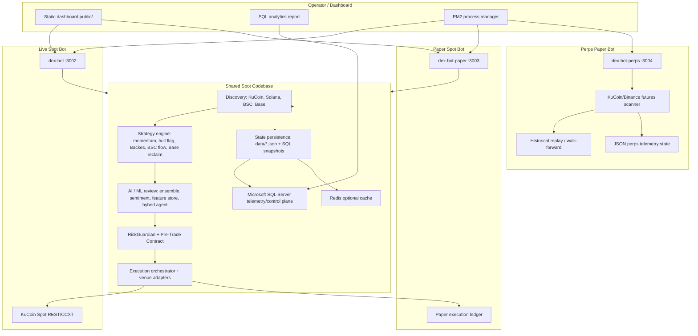
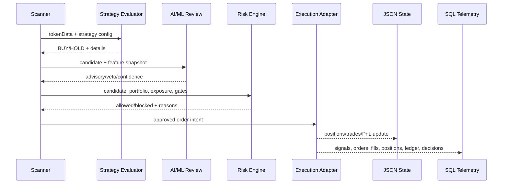
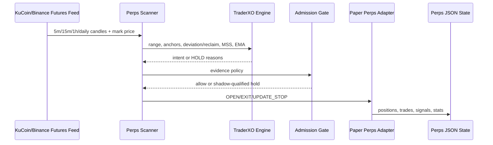
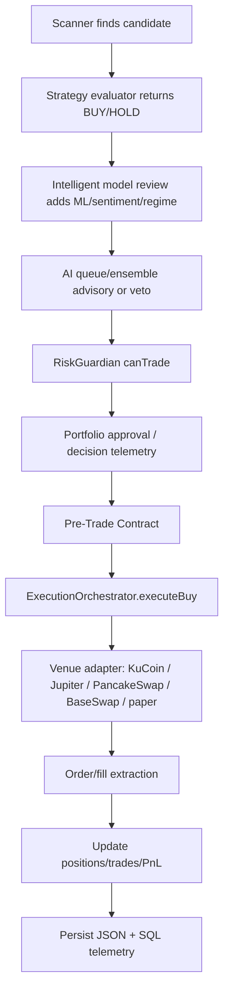

# Crypto Trading Bot Infrastructure Technical Documentation

Generated: 2026-06-05  
Scope:

- Live Spot Bot: `C:\Users\User_\Desktop\dex-trading-bot`
- Paper Trading Bot: `C:\Users\User_\Desktop\dex-trading-bot-paper`
- Perpetual Futures Bot: `C:\Users\User_\Desktop\dex-trading-bot-perps`

This document describes the implemented infrastructure, not a generic target architecture. Where a component is present but optional or disabled by environment flags, that is stated explicitly.

## 1. Executive Summary And Architecture Overview

### Purpose

The infrastructure is split into three bot environments with different risk surfaces:

| Environment | Runtime | Primary purpose | Execution surface | Current isolation model |
|---|---|---|---|---|
| Paper Trading Bot | `dex-bot-paper`, port `3003` | Forward-test strategies, generate evidence, exercise SQL/dashboard/ML paths without live capital | Simulated spot/DEX/CEX execution in shared spot codebase | Separate worktree, `BOT_PROFILE=paper`, `PAPER_TRADING=true`, separate `data/`, same SQL schema by `bot_profile` |
| Live Spot Bot | `dex-bot`, port `3002` | Execute approved live spot strategies | KuCoin spot first; DEX routes exist but live-chain gates apply | Separate worktree, `BOT_PROFILE=live`, live credentials, live risk gates, singleton lock |
| Perpetual Futures Bot | `dex-bot-perps`, port `3004` | Isolated perps paper/research scanner and telemetry service | Paper-only perps adapter; live perps execution intentionally disabled | Separate repo, localhost-only API, required V2 SQL telemetry/control-plane, JSON recovery snapshots, admission gate |

Live and paper spot bots share the same application architecture and most source modules. Their behavior diverges through environment variables, `config/index.js`, PM2 process configuration, risk gates, strategy enablement, and the `config.paperTrading` flag.

The perps bot remains a separate project with its own strategy engine, scanner, and paper execution adapter, but V2 now routes perps signals, trades, positions, execution lifecycle events, state snapshots, admission state, live-readiness audits, and canary-policy audits into SQL under `bot_profile='paper_perps'`. JSON files are retained as local recovery/cache snapshots, not the intended V2 reporting authority.

### High-Level Architecture

### Relationship Between Bots

| Area | Paper Spot | Live Spot | Perps |
|---|---|---|---|
| Repository | `dex-trading-bot-paper` | `dex-trading-bot` | `dex-trading-bot-perps` |
| Runtime entry | `src/index.js` | `src/index.js` | `src/index.js` |
| Process manager | PM2 app `dex-bot-paper` | PM2 app `dex-bot` | PM2 app `dex-bot-perps` |
| Main dashboard | Express/static dashboard on port `3003` | Express/static dashboard on port `3002` | Local HTTP API on port `3004`; dashboard reads perps API separately |
| SQL telemetry | Same schema, separated by `bot_profile='paper'` | Same schema, separated by `bot_profile='live'` | V2 perps SQL control plane under `bot_profile='paper_perps'`; JSON remains recovery/cache |
| Risk capital | Simulated paper balance | Live wallet/exchange balances | Simulated perps equity |
| Strategy sharing | Same spot strategy modules | Same spot strategy modules | Separate perps strategy modules |
| Live order capability | Disabled by `PAPER_TRADING=true` | Enabled for live spot routes allowed by config/risk | Disabled in code; paper/research service only |

### Runtime Ports And Profiles

| Process | Port | Profile | Bind behavior |
|---|---:|---|---|
| `dex-bot` | `3002` | `live` | Dashboard bind host from `DASHBOARD_BIND_HOST`, currently `0.0.0.0` |
| `dex-bot-paper` | `3003` | `paper` | Dashboard bind host from `DASHBOARD_BIND_HOST`, currently `0.0.0.0` |
| `dex-bot-perps` | `3004` | `perps-paper` | Perps server binds localhost-only in code |

## 2. Database Architecture

### Database Summary

| Storage system | Used by | Purpose | Notes |
|---|---|---|---|
| Microsoft SQL Server via `mssql` | Live spot, paper spot | Durable telemetry, decisions, trades, positions, risk/config governance, AI logs, model registry | Primary durable database for spot/paper. Schema in `src/utils/sqlServer.js` and `db/migrations/*.sql`. |
| Redis | Live spot, paper spot | Optional runtime cache fallback | `src/index.js` creates a Redis client if available. If unavailable, in-memory cache remains active. |
| Local JSON files | Live spot, paper spot, perps | Runtime state snapshots, market state, agent memory, perps recovery snapshots | Atomic file writes and SQL snapshot fallback are used for spot/paper. Perps uses SQL-first V2 telemetry/control-plane with JSON fallback snapshots for local recovery. |
| Local ML artifacts | Live spot, paper spot | Sidecar/external model artifacts and datasets | `artifacts/models/*`, `artifacts/sentiment/*`. Model metadata is also stored in SQL. |
| PostgreSQL / TimescaleDB / MongoDB | None detected | Not used by current codebase | The implementation is SQL Server plus local JSON/cache. |

### Spot/Paper SQL Server Role

The shared spot code uses SQL Server as both telemetry warehouse and control plane. It stores:

- Bot run lifecycle and health.
- Candidate signals and AI decisions.
- Orders, fills, positions, PnL, and trade ledger.
- Rejection reasons and risk-gate outcomes.
- Hot-reloadable config, risk rules, sell tiers, symbol overrides.
- Strategy versions and promotion events.
- Learning memory, agent lessons, self-evolution history.
- ML registry, feature snapshots, predictions, sentiment, RL policies, and multi-agent decisions.

The spot and paper bots use the same table names. Isolation is logical through `bot_profile`, `scope`, and PM2 worktree separation. Tables that must serve both profiles should always be queried with a `bot_profile` or `scope` predicate.

### Core SQL Tables

| Table | Purpose | Key columns / fields | Main indexes |
|---|---|---|---|
| `dbo.bot_kv` | Generic key/value store | `k`, `v`, `updated_at`, `ver` rowversion | Primary key on `k` |
| `dbo.bot_locks` | Distributed lock coordination | `resource`, `owner`, `acquired_at`, `expires_at`, `updated_at` | `IX_bot_locks_expires_at` |
| `dbo.bot_runs` | Runtime lifecycle audit | `run_id`, `bot_profile`, `host`, `pid`, `git_sha`, `config_hash`, `started_at`, `ended_at`, `exit_reason`, `meta_json` | `IX_bot_runs_started_at` |
| `dbo.signals` | Candidate and final signal telemetry | `signal_id`, `run_id`, `ts`, `bot_profile`, `chain_key`, `symbol`, `address`, `strategy`, `final_signal`, `technical_signal`, `signal_source`, `confidence`, `ai_confidence`, `features_json`, `gate_json`, `reject_reasons_json`, `signal_score`, `retention_tier`, `ai_decision_id` | `IX_signals_ts`, `IX_signals_chain_strategy_signal`, `IX_signals_ai_decision_id`, `IX_signals_retention_tier_ts` |
| `dbo.orders` | Order attempt ledger | `order_id`, `run_id`, `ts`, `bot_profile`, `chain_key`, `symbol`, `side`, `strategy`, `requested_quote_usd`, `requested_base_qty`, `expected_price`, `status`, `reason`, `client_order_key`, `metadata_json` | `IX_orders_run_ts` |
| `dbo.fills` | Fill and settlement detail | `fill_id`, `order_id`, `ts`, `txid_or_exchange_id`, `filled_base_qty`, `filled_quote_usd`, `avg_price`, `fee_usd`, `slippage_bps`, `block_number`, `confirmations`, `raw_receipt_json` | `IX_fills_order_ts` |
| `dbo.positions` | Open/closed position ledger | `position_id`, `run_id`, `bot_profile`, `chain_key`, `symbol`, `strategy`, `opened_at`, `closed_at`, `entry_price`, `entry_usd`, `exit_price`, `exit_usd`, `pnl_usd`, `pnl_pct`, `exit_reason`, `tags_json` | `IX_positions_run_opened`, `IX_positions_open_chain` |
| `dbo.position_snapshots` | Time-series position risk/PnL snapshots | `snapshot_id`, `position_id`, `ts`, `price`, `unrealized_pnl_usd`, `highest_price`, `trailing_stop`, `risk_state_json` | `IX_position_snapshots_position_ts` |
| `dbo.bot_trade_ledger` | Unified trade ledger used by dashboard and stats | `trade_id`, `bot_profile`, `ts`, `trade_type`, `symbol`, `chain_key`, `strategy`, `price`, `quantity`, `value_usd`, `pnl_usd`, `txid`, `signal_source`, `reason`, `setup_type`, `raw_trade_json` | `IX_bot_trade_ledger_profile_ts`, filtered `IX_bot_trade_ledger_setup_type_ts` |
| `dbo.bot_pnl_history` | Portfolio equity curve | `pnl_point_id`, `bot_profile`, `ts`, `cash`, `equity`, `total_pnl`, `unrealized_pnl`, `reason` | `IX_bot_pnl_history_profile_ts` |
| `dbo.ops_events` | Operational observability events | `event_id`, `run_id`, `bot_profile`, `ts`, `severity`, `category`, `name`, `chain_key`, `symbol`, `duration_ms`, `context_json`, `message` | `IX_ops_events_ts`, `IX_ops_events_severity_category` |
| `dbo.bot_state_snapshots` | SQL fallback snapshot for local state files | `snapshot_id`, `run_id`, `bot_profile`, `snapshot_kind`, `ts`, `state_json`, `market_state_json`, `stats_json` | `IX_bot_state_snapshots_profile_kind_ts` |

### Control Plane Tables

| Table | Purpose | Key fields |
|---|---|---|
| `dbo.schema_migrations` | Tracks applied migrations | `version`, `name`, `applied_at`, `checksum` |
| `dbo._schema_version` | Schema version pin/gate | `version`, `updated_at` |
| `dbo.strategy_config` | Hot-reloadable strategy/runtime knobs | `scope`, `strategy`, `knob`, `value`, `value_type`, `source`, `active`, `updated_by` |
| `dbo.config_changes` | Audit trail of config edits | `scope`, `knob`, `old_value`, `new_value`, `changed_at`, `changed_by`, `reason` |
| `dbo.symbol_overrides` | Symbol-level block/prefer/size/custom-stop overrides | `symbol`, `chain`, `scope`, `action`, `value`, `reason`, `source`, `expires_at`, `active` |
| `dbo.sell_tiers` | Configurable sell-tier policy | `scope`, `strategy`, `tier_index`, `sell_pct`, `profit_pct`, `chain`, `active` |
| `dbo.risk_rules` | Pre-trade contract gate registry | `name`, `scope`, `severity`, `enabled`, `description`, `config_json`, `source` |
| `dbo.trade_rejections` | Audit of blocked trade attempts | `rejected_at`, `scope`, `strategy`, `side`, `symbol`, `chain`, `gate`, `severity`, `reason`, `requested_size_usd`, `wallet_usd`, `metadata` |
| `dbo.ai_prompts` | DB-driven AI prompt templates | `name`, `version`, `scope`, `provider`, `template`, `system_msg`, `active` |
| `dbo.job_queue` | Crash-recoverable background work queue | `job_id`, `job_type`, `scope`, `payload`, `status`, `attempts`, `claimed_by`, `visible_after`, `result`, `last_error` |

### AI, ML, Learning, And Evolution Tables

| Table | Purpose | Key fields |
|---|---|---|
| `dbo.ai_decisions` | Per AI inference call | `provider`, `model`, `purpose`, `symbol`, `chain`, `prompt_name`, `request_tokens`, `response_tokens`, `cost_usd`, `latency_ms`, `success`, `signal`, `confidence`, `metadata` |
| `dbo.ai_decisions_rollup` | Daily aggregate of old AI calls | `day`, `scope`, `provider`, `model`, `purpose`, `call_count`, `success_count`, `total_cost_usd`, `avg_latency_ms`, `buy_count`, `hold_count`, `sell_count` |
| `dbo.ml_model_versions` | Migration-defined ML model version metadata | `model_name`, `scope`, `stage`, `status`, `metrics_json`, `active`, `retired_at` |
| `dbo.model_registry` | Runtime model registry | `model_id`, `model_family`, `task_class`, `provider`, `display_name`, `metadata_json` |
| `dbo.model_versions` | Active/pending model versions | `version_id`, `model_id`, `bot_profile`, `stage`, `status`, `regime_family`, `feature_schema_json`, `params_json`, `metrics_json` |
| `dbo.model_feature_store` | Feature snapshots for training/inference | `feature_id`, `bot_profile`, `ts`, `chain_key`, `symbol`, `strategy`, `regime_label`, `source`, `features_json` |
| `dbo.model_predictions` | ML prediction records | `prediction_id`, `version_id`, `bot_profile`, `ts`, `symbol`, `task_class`, `signal`, `confidence`, `score`, `explanation_json` |
| `dbo.sentiment_snapshots` | Sentiment feature history | `snapshot_id`, `bot_profile`, `ts`, `chain_key`, `symbol`, `aggregate_score`, `signal`, `confidence`, `news_count`, `reddit_count`, `feature_json` |
| `dbo.rl_policy_registry` | Reinforcement learning policies | `policy_id`, `policy_name`, `bot_profile`, `stage`, `status`, `policy_json`, `metrics_json` |
| `dbo.multi_agent_decisions` | Hybrid agent outputs | `decision_id`, `bot_profile`, `ts`, `symbol`, `task_class`, `regime_family`, `final_signal`, `confidence`, `route_json`, `context_json` |
| `dbo.learning_bad_token_memory` | Learned token bans/strikes | `bot_profile`, `token_key`, `chain_key`, `symbol`, `strikes`, `hard_ban`, `ban_until`, `last_reason`, `reasons_json` |
| `dbo.learning_sleeve_performance` | Per sleeve win-rate/size history | `sleeve_key`, `strategy`, `recent_win_rate_pct`, `size_multiplier`, `wins`, `losses`, `outcomes_json` |
| `dbo.learning_brain_profiles` | Momentum/adaptive brain stats | `profile_key`, `chain_key`, `strategy`, `lane`, `trigger_name`, `samples`, `wins`, `losses`, `total_pnl`, `recent_win_rate_pct` |
| `dbo.strategy_brain_profiles` | Strategy archetype performance | `profile_key`, `chain_key`, `strategy`, `archetype`, `samples`, `wins`, `losses`, `total_pnl` |
| `dbo.strategy_brain_adjustments` | Adaptive parameter deltas | `adjustment_key`, `rsi_buy_threshold_delta`, `volume_spike_multiplier_delta`, `min_price_change_24h_pct_all_delta`, `max_price_change_24h_pct_all_delta` |
| `dbo.strategy_brain_mutations` | Mutation proposals/outcomes | `mutation_id`, `bot_profile`, `ts`, `adjustment_key`, `source_profile`, `recent_win_rate_pct`, `adjustment_json` |
| `dbo.strategy_versions` | Strategy/code/config version registry | `version_id`, `version_hash`, `bot_profile`, `stage`, `candidate_id`, `config_hash`, `code_hash`, `metadata_json` |
| `dbo.promotion_events` | Paper-to-live promotion lifecycle | `event_id`, `version_id`, `bot_profile`, `event_type`, `stage`, `status`, `discrepancy_score`, `promotion_confidence`, `approval_required`, `approved_by` |
| `dbo.self_evolution_history` | Self-evolution history | `history_id`, `bot_profile`, `ts`, `status`, `summary`, `reason`, `proposal_path`, `raw_entry_json` |
| `dbo.evolution_history` | Migration-defined evolution audit | `patch_id`, `scope`, `decision`, `status`, `metrics_before_json`, `metrics_after_json` |
| `dbo.agent_trade_lessons` | Agent memory trade lessons | `lesson_id`, `memory_scope`, `symbol`, `strategy`, `outcome`, `pnl_usd`, `lesson_text`, `entry_conditions_json`, `bot_profile` |
| `dbo.agent_strategy_discoveries` | Strategy discovery notes | `discovery_id`, `memory_scope`, `source`, `theme`, `sector`, `insight`, `proposed_action`, `urgency`, `applied` |
| `dbo.agent_token_blacklist` | Agent-driven blacklist | `memory_scope`, `symbol`, `reason`, `source`, `expires_at` |
| `dbo.agent_token_preferences` | Agent-driven preference boosts | `memory_scope`, `symbol`, `boost`, `reason`, `research_summary`, `expires_at` |
| `dbo.agent_evolution_outcomes` | Evolution result metrics | `outcome_id`, `memory_scope`, `patch_summary`, `pf_before`, `pf_after`, `wr_before`, `wr_after`, `verdict` |
| `dbo.agent_knowledge_base` | General agent knowledge | `knowledge_id`, `memory_scope`, `category`, `insight`, `source`, `confidence` |
| `dbo.intelligence_reports` | Market intelligence snapshots | `report_id`, `bot_profile`, `ts`, `macro_sentiment`, `sentiment_score`, `summary`, `report_json` |
| `dbo.regime_patterns` | Regime/strategy recommendations | `regime`, `strategy`, `scope`, `recommendation`, `confidence`, `active`, `measured_at`, `metadata_json` |
| `dbo.backtest_runs` | Backtest results | `run_id`, `patch_id`, `scope`, `strategy`, `started_at`, `status`, `metrics_json`, `result_json` |
| `dbo.health_checks` | Health canary observations | `check_name`, `checked_at`, `ok`, `latency_ms`, `failure_count`, `metadata_json` |
| `dbo.tokens` | Token metadata cache | `symbol`, `chain`, `address`, `pair_address`, `liquidity_usd`, `volume_24h_usd`, `market_cap_usd`, `price_usd`, `holder_count`, `metadata_json`, `refreshed_at` |

### Indexing Strategy

The schema uses practical hot-path indexes rather than heavy partitioning:

- Time-descending indexes on telemetry tables: `signals`, `ops_events`, `bot_runs`, `bot_trade_ledger`, `bot_pnl_history`, `health_checks`, `ai_decisions`.
- Profile-scoped indexes for dashboards: `bot_profile, ts DESC`, `bot_profile, setup_type, ts DESC`.
- Symbol drilldown indexes: `symbol, chain, decided_at DESC`, `symbol, chain, rejected_at DESC`.
- Active-row filtered unique indexes for config/rules: `strategy_config`, `symbol_overrides`, `sell_tiers`, `ai_prompts`, `risk_rules`.
- Stale/retention indexes: `tokens.refreshed_at`, `signals.retention_tier, ts`, `job_queue.status, visible_after, job_type`.

No physical table partitioning was detected. Retention is currently implemented by pruning/rollup jobs and retention-tier columns:

- `ai_decisions`: migration comment states full retention for 7 days, older data aggregated into `ai_decisions_rollup`.
- `trade_rejections`: migration comment states 30-day retention.
- `signals`: `retention_tier` defaults to `30d`.
- `SQL_AUTO_PRUNE_ENABLED=true` and `SQL_AUTO_PRUNE_INTERVAL_MS=3600000` are configured in PM2 for live/paper.

### Local JSON State

Spot/paper runtime state files:

| File pattern | Purpose |
|---|---|
| `data/state.json` | Portfolio cash, positions, trades, stats, learning state |
| `data/marketState.json` | Tracked tokens, scan state, signals, macro state, backtests |
| `data/state.backup.json`, `data/marketState.backup.json` | Backup copies for recovery |
| `data/self-evolution-history.jsonl` | Append-only local self-evolution history |
| `data/agent-memory.json` | Local agent memory when SQL memory is not authoritative |

Spot/paper state persistence also writes compact snapshots into `dbo.bot_state_snapshots`. On startup, the bot can restore from SQL if disk state is missing or corrupt and SQL restore is enabled.

Perps SQL and JSON state:

The perps bot writes the V2 control-plane view through SQL tables/views for `paper_perps`, including perps signal telemetry, trades, positions, state snapshots, execution lifecycle events, promotion readiness, and portfolio exposure snapshots. On startup, SQL restore is attempted first when enabled and required; local JSON is used when it is fresher or SQL is unavailable according to the configured restore policy.

Perps local JSON files:

| File | Purpose |
|---|---|
| `data/perps-paper-state.json` | Local perps recovery/cache snapshot |
| `data/perps-paper-open-positions.json` | Legacy/open position snapshot |
| `data/perps-paper-trades.json` | Legacy/completed trade snapshot |
| `data/perps-paper-signals.json` | Signal event history |
| `data/traderxo-paper-admission.json` | Historical evidence/admission status |
| `config/kucoin-perps-universe.json` | Refreshed KuCoin futures contract universe and maintenance-margin metadata |

### Data Flow

Perps equivalent:

## 3. API Integrations

### API Integration Matrix

| Integration | Used by | Authentication | Main use |
|---|---|---|---|
| KuCoin Spot via `ccxt` | Live/paper spot | API key, secret, passphrase, sandbox flag | Spot tickers, candles, order books, balances, market/limit buy/sell, trade recovery |
| KuCoin Futures public API/WS | Perps | Public for current implementation | Active contract universe, futures candles, mark price websocket |
| Binance Futures public REST/WS | Perps fallback/source option | Public for current implementation | Futures candles and mark price websocket |
| Binance Spot public REST | Dashboard/market data | Public | `/api/v3/klines`, BNB/USDT reference price |
| Jupiter Aggregator API v6 | Paper spot Solana, live only if enabled | Wallet private key for swaps; public quote/swap endpoints | Solana quotes, swap transaction build, DEX routing |
| Solana RPC / Helius | Paper spot Solana, optional live DEX | RPC URL/API key, wallet private key | Transaction signing/submission, token metadata, on-chain metrics |
| PancakeSwap / BSC RPC | Paper spot BSC, live only if enabled | EVM private key, RPC URLs | BSC DEX swaps, token data, honeypot/friction checks |
| BaseSwap / Base RPC | Paper spot Base, live only if enabled | EVM private key, RPC URLs | Base DEX swaps, token data, reclaim strategy |
| DexScreener | Spot discovery and token data | Public | Token pairs, boosts, new/trending pools, liquidity, volume |
| Birdeye | Solana token data | API key in `X-API-KEY` | Token overview, 10m buy/sell flow, liquidity, price |
| CoinGecko / CoinMarketCap / CoinPaprika / Polygon | Market metadata | Public/API key depending provider | Token metrics, market data, external metadata |
| GoPlus / honeypot.is | DEX safety checks | Public/API key depending config | Honeypot, tax, contract risk, BSC safety |
| DefiLlama / Solscan | Optional on-chain metrics | Public/API key depending config | TVL, holders, token info |
| Telegram Bot API | Live/paper notifications | Bot token/chat id | Heartbeats, trade alerts, health/safe-mode alerts |
| AI providers | Live/paper AI/ML | API keys | Trade review, self-evolution proposals, sentiment/research |

### KuCoin Spot

Implementation: `src/exchanges/kucoin.js`

Authentication:

- Uses `ccxt.kucoin` with `apiKey`, `secret`, `password`, `sandbox`, `enableRateLimit=true`.
- Order idempotency uses KuCoin `clientOid`.
- Private endpoints require valid KuCoin credentials configured in `config.kucoin`.

Market data:

- `loadMarkets()`, daily forced reload.
- `fetchTickers()` for USDT universe refresh.
- `publicGetMarketCandles` or `fetchOHLCV` for OHLCV.
- `fetchOrderBook(symbol, 20)` for order book depth and imbalance.

Execution:

- Market buy uses quote `funds` and caps against free USDT.
- Limit buy/sell logic exists for configured cases.
- Sell logic includes quote/funds fallback and order re-fetch.
- Filled orders are verified by `fetchOrder` and `fetchMyTrades` where needed.

Rate limits and failover:

- CCXT rate limiter is enabled.
- Explicit 429 handler uses exponential backoff: 5 seconds, 10 seconds, doubling to 5 minutes.
- Structural errors schedule exchange reinitialization with exponential backoff up to 30 minutes.
- Stale/missing symbols are removed from the scan universe when KuCoin reports market-symbol errors.

Security:

- Credentials are read from config/environment, not hardcoded.
- Logs should not include raw secrets.
- IP whitelisting should be enforced at KuCoin account level; this is external to the code.

### Solana / Jupiter

Implementation: `src/exchanges/jupiter.js`

Authentication:

- Wallet loaded from Solana private key using `@solana/web3.js`.
- Birdeye uses `X-API-KEY`.
- Jupiter quote and swap endpoints are public, but swaps require signed transactions.

REST endpoints:

- `https://quote-api.jup.ag/v6/quote`
- `https://quote-api.jup.ag/v6/swap`
- DexScreener token endpoints.
- Birdeye token overview endpoint.
- Optional Solscan and DefiLlama calls.

Execution:

- Quotes are fetched with configured slippage.
- Swap transactions are built through Jupiter and signed by the local wallet.
- Large Solana buys can be split by `executeBuyViaVenue` when `shouldSplitSolanaTrade` returns true.

Rate limit handling:

- Birdeye RPM cap is enforced by a local request window.
- Birdeye cooldown is applied on rate-limit responses.
- DexScreener calls use throttled fetch/cache.
- Token data cache TTL is age adaptive: fresher/newer tokens get shorter TTL.

### BSC / PancakeSwap

Implementation: `src/exchanges/pancakeswap.js`

Authentication:

- EVM private key and RPC URLs.
- Router/factory/WBNB/BUSD addresses from config.

Execution:

- Uses router ABI calls:
  - `getAmountsOut`
  - `swapExactETHForTokensSupportingFeeOnTransferTokens`
  - `swapExactTokensForETHSupportingFeeOnTransferTokens`
  - `swapExactTokensForTokensSupportingFeeOnTransferTokens`
  - ERC20 `approve`, `allowance`, `balanceOf`
- Uses nonce manager for transaction sequencing.
- Applies max slippage bps and strategy-specific slippage caps.
- Supports MEV/private-route checks where configured.

Safety:

- Honeypot and tax checks through external APIs.
- Round-trip friction check can block tokens with excessive tax/slippage.
- Live BSC entries are gated by environment and risk config.

### Base / BaseSwap

Implementation: `src/exchanges/baseswap.js`

Authentication:

- Base RPC, EVM private key, router/factory/WETH config.

Execution:

- Similar DEX router flow to PancakeSwap, adapted for Base and BaseSwap.

Discovery:

- GeckoTerminal network pool endpoints for Base new/trending pools.
- DexScreener fallback style token metadata.

### Perps Public Feeds

Implementation:

- `src/market/kucoin-public-perps.js`
- `src/market/kucoin-perps-ws.js`
- `src/market/binance-public-perps.js`
- `src/market/binance-perps-ws.js`
- `src/exchanges/binance-perps-rest.js` for a live-capable Binance wrapper, guarded elsewhere.

KuCoin futures:

- Active contract universe from `https://api-futures.kucoin.com/api/v1/contracts/active`.
- Candles through KuCoin futures public kline endpoint.
- WebSocket bullet endpoint is used to subscribe to `/contract/instrument` mark price streams.
- Universe auto-refresh can update subscribed symbols.

Binance futures:

- Public kline endpoint.
- Mark price websocket.
- Signed REST implementation exists with HMAC SHA256 for order/account/position paths, but live execution is disabled until evidence gates pass.

Perps server security:

- `src/server.js` requires `PERPS_ADMIN_TOKEN` for all POST routes.
- If `PERPS_ADMIN_TOKEN` is unset, POST routes fail closed with `503`.
- Token comparison uses constant-time `timingSafeEqual`.
- Server binds localhost-only in `src/index.js`.

### AI Provider APIs

Implementation:

- `src/ai/ensemble.js`
- `src/ai/decision-tracker.js`
- `src/self-evolution.js`
- `src/utils/anthropic.js`
- Provider-specific utility modules.

Providers:

| Provider | Use | Auth |
|---|---|---|
| Anthropic | Primary/fallback trade review if enabled | API key |
| Groq | Ensemble trade review and self-evolution fallback | API key |
| Gemini | Ensemble/self-evolution fallback | API key |
| Nvidia | Ensemble/research utility | API key |
| Cerebras | Ensemble/self-evolution fallback | API key |
| Mistral | Self-evolution plan generation | API key |
| OpenRouter | Ensemble/self-evolution fallback | API key |
| SambaNova | Ensemble/self-evolution fallback | API key |
| Together | Ensemble/self-evolution fallback | API key |

Rate and failure handling:

- Per-provider backoff for 429s.
- Provider failure counters auto-disable a provider temporarily after repeated non-rate-limit failures.
- Groq and Gemini have daily local quota counters.
- AI calls are tracked into `dbo.ai_decisions` with latency, tokens, estimated cost, signal, and confidence.

## 4. AI/ML Components

### AI/ML Overview

| Component | Module | Purpose | Output |
|---|---|---|---|
| AI ensemble | `src/ai/ensemble.js` | LLM-based trade-signal review with provider fallback | `BUY`, `HOLD`, `SELL`, confidence, risk flags |
| AI decision queue | `src/ai/decision-queue.js` | Non-blocking AI cache/queue so scans are not stalled by provider latency | Cached/pending AI decision status |
| Prompt loader | `src/ai/prompt-loader.js` | DB-backed prompt templates with fallback inline prompt | Rendered prompt |
| Decision tracker | `src/ai/decision-tracker.js` | SQL persistence for provider calls | `dbo.ai_decisions` rows |
| Intelligent model review | `src/ai/intelligent-model-review.js` | Runs sentiment, feature snapshot, order book, regime, hybrid decision | Mutates `evaluation.details` |
| Model registry | `src/utils/model-registry.js` | SQL model registry, feature store, predictions, sentiment, RL policy tables | Active model versions and persisted model artifacts |
| Sentiment engine | `src/utils/sentiment-engine.js` | News/reddit/text sentiment and optional Python sidecar sentiment | Aggregate sentiment score/signal |
| Hybrid agent | `src/utils/hybrid-agent-orchestrator.js` | Blends technical, ML, RL, sentiment, and LLM routes | Final hybrid signal/confidence |
| RL policy | `src/utils/rl-policy.js`, `src/utils/rl-online-updater.js` | Q-policy training/inference and online updates | RL action/policy updates |
| Self-evolution | `src/self-evolution.js`, `src/utils/self-evolution-orchestration.js` | Proposes and governs code/config improvements | Candidate changes, promotion/evaluation events |

### Input Features

Feature sources include:

- Price and volume history: closes, returns, volume spikes, realized volatility.
- Technical indicators: RSI, EMA rhythm, candle structure, regime labels.
- Token microstructure: liquidity, 24h volume, spread, order book imbalance, bid/ask depth.
- DEX flow: buy/sell transaction ratios, net buy flow, unique buyers, top-holder concentration.
- Market context: BTC risk-off, macro regime, sector intelligence, catalyst cache.
- Position context: open positions, drawdown, profit factor, win rate, consecutive losses, symbol loss memory.
- Sentiment context: news, Reddit, X if configured, token metadata sentiment fields.
- Perps context: 5m/15m/1h candles, daily anchors, horizontal ranges, mark price, funding/fees/slippage.

### Model Architecture

The implementation contains several model classes rather than one monolithic model:

- Native JavaScript surrogate models:
  - `xgboost_surrogate`
  - `random_forest_surrogate`
  - `lstm_sequence_surrogate`
  - `custom_sentiment_engine`
- Python sidecar external models:
  - `xgboost_production`
  - `random_forest_production`
  - Sentiment models/artifacts such as VADER and FinBERT-like artifact directories.
- LLM ensemble:
  - Provider fallback sequence with JSON-only signal output.
- Bayesian/hybrid routing:
  - Hybrid agent derives route weights by regime/task class and aggregates technical, ML, RL, sentiment, and LLM scores.

### Training And Retraining

Relevant scripts from `package.json` include:

| Script | Purpose |
|---|---|
| `models:init` | Initialize model registry/tables/artifacts |
| `models:train` | Train external models |
| `models:sync` | Sync trained models/metadata |
| `models:smoke` | Smoke-test model inference |
| `rl:train` | Train RL policy |
| `rl:smoke` | Smoke-test RL inference |
| `research:hyperopt` | Hyperparameter optimization |
| `research:validate` | Validation framework |
| `research:run` | Research/backtest execution |
| `python:sidecar:health` | Python sidecar health check |

The model registry requires at least `MIN_TRAINING_ROWS=150` in `src/utils/model-registry.js` for trainable external models and uses a training label window of 240 minutes.

### How AI Outputs Are Used

1. The technical evaluator produces a first-pass `BUY` or `HOLD`.
2. Intelligent model review may add feature snapshots, sentiment, orderbook, regime, and hybrid outputs.
3. If AI review is enabled and a candidate is a `BUY`, the AI decision queue or direct AI call reviews it.
4. The AI result can:
   - Approve the candidate.
   - Veto to `HOLD`.
   - Act as advisory only for specific fallback paths.
   - Raise/lower confidence and add risk flags.
5. Signal cascade can require at least two of technical, AI, and sentiment confirmation.
6. The pre-trade contract and portfolio risk engine still run after AI approval.

### Human-In-The-Loop Controls

- Dashboard write endpoints require an admin token when configured.
- `/api/promotion/approve` records manual approval into SQL.
- Strategy versions and promotion events track stage, approval, rollback, and discrepancy score.
- Self-evolution auto-apply and live mutation are disabled in the PM2 environment for live and paper.
- Perps POST writes require `PERPS_ADMIN_TOKEN`.

## 5. Trading Strategies In Depth

### Strategy Deployment Matrix

| Strategy | Category | Paper | Live Spot | Perps | Stage |
|---|---|---:|---:|---:|---|
| `momentum` | Short-term momentum/scanner | Yes | Yes, KuCoin-focused | No | Production |
| `spot_day_bull_flag` | Long-only spot day-trading breakout | Yes, KuCoin | Yes, KuCoin canary | No | Live canary |
| `solana_bull_flag_v2` | Solana-adapted bull flag | Yes | No | No | Paper runtime canary |
| `backes_swing` | HTF swing/retest structures | Yes | No | No | Paper runtime canary |
| `bsc_flow_breakout` | BSC liquidity/buy-flow breakout | Yes | No by deployment metadata | No | Paper runtime canary |
| `base_dex_momentum_reclaim` | Base DEX support/momentum reclaim | Yes | No | No | Paper runtime canary |
| `traderxo_perps` | Perps range/deviation/level-to-level | No | No | Yes, paper/research | Perps paper |

### Momentum

Category: scanner momentum with technical, flow, AI, and risk overlays.  
Modules: `src/index.js`, `src/cycle/momentum-scanner.js`, `src/scoring/momentum-rotation.js`, `src/utils/token-decision-pipeline.js`.

Runs on:

- Live: KuCoin-focused momentum.
- Paper: Solana, BSC, KuCoin depending configured chains.

Entry logic:

- Candidate must pass strategy prefilter: configured minimum 24h volume, liquidity, token age.
- Runtime computes or reads:
  - RSI.
  - Volume spike.
  - 24h price change.
  - Recent buy ratio.
  - Net buy flow.
  - Liquidity.
  - Optional order book imbalance and timeframe confluence.
- Base gates:
  - RSI must be inside `rsiBuyThreshold` to `rsiBuyMaxThreshold`, unless missing RSI fallback is allowed by strong momentum/flow/volume.
  - Volume spike or strong move must confirm.
  - Buy flow, buy ratio, strong move, or KuCoin volume proxy must confirm.
  - Chain-specific min/max move windows block late chasing or weak candidates.
  - Liquidity must be finite and positive.
- Additional blockers:
  - Recovery mode can block exploration and require both flow and volume.
  - Symbol loss memory can raise required confidence.
  - Strategy brain can block underperforming archetypes.
  - Learned hard bans and agent memory blacklists block.
  - BTC macro risk-off can block altcoin entries.
  - External SELL signal or bearish higher-timeframe pattern blocks.

Exit logic:

- Momentum exit checks run on their own timer.
- Exit triggers include:
  - RSI fade with sell pressure.
  - 24h momentum fade.
  - Volume collapse while sell ratio rises.
  - Profit-taking and trailing-stop logic from execution helpers.
  - Max-hold and stop logic governed by risk/execution modules.

Position sizing:

- Default uses `PositionSizingEngine.calculateSmallIterationSize`.
- Starts at 25 percent of the normal max position size.
- Multiplies by symbol win rate, iteration number, confidence, regime, drawdown, and hot/cold streaks.
- Caps sizing during loss streaks and low win-rate regimes.

Performance metrics tracked:

- Win rate, profit factor, realized/unrealized PnL, consecutive losses, drawdown.
- Signal drought and rejection reasons by strategy.
- AI decision cost/latency, decision confidence.
- Momentum rotation score, candidate/open-position strength.

### Spot Day Bull Flag

Category: long-only spot day-trading momentum breakout.  
Modules: `src/strategies/bull-flag-detector.js`, `src/strategies/bull-flag-evaluator.js`, `src/execution/orchestrator.js`.

Runs on:

- Live: KuCoin spot, canary risk limits.
- Paper: KuCoin spot.

Detector rules:

- Input: closed OHLCV candles, oldest to newest.
- Pole:
  - 1 to 4 candles by default.
  - Price advance must meet `polePctMin`.
  - Net pole advance must also meet `polePctMin`; wick-only poles are rejected.
  - No pole candle may drop materially below the pole start.
- Flag:
  - 2 to 8 candles by default.
  - Flag high must not exceed pole high.
  - Flag upward drift capped.
  - Flag retrace depth capped by `flagDepthMaxPct`.
  - Flag volume median must contract below `flagVolContractMaxRatio` times pole volume median.
- Breakout:
  - Latest closed candle must close above flag high or descending trendline.
  - Breakout volume must be at least `breakoutVolMinRatio` times flag-volume median.
  - Latest volume must clear prior median volume floor when enabled.
  - 60-minute move must be within min/max configured bounds.

Evaluator gates:

- Strategy and chain must be enabled.
- 24h volume and liquidity floors must pass.
- Token age floor can apply.
- EMA confirmation:
  - 15m close above or near EMA 9.
  - EMA 9 above or near EMA 21.
- 1h confirmation:
  - Latest 1h candle is green or holds above prior 1h midpoint.
- Stop-distance hard cap.
- Net edge after fees, slippage, and spread must exceed `minNetEdgePct`.
- Stop distance must be wider than the round-trip cost buffer.
- Entry cannot be too close to measured-move target.
- Reward-to-risk must clear `minRR`.
- Order book must not show ask-wall dominance.

Sizing and risk:

- Uses flat percent-of-equity risk divided by stop distance.
- Base risk defaults from strategy config, with A+ risk if volume expansion and flag depth qualify.
- Max concurrent bull-flag positions enforced.
- Daily bull-flag loss halt uses realized loss in R.
- Size is capped by global max position size percent to avoid runaway sizing on tight stops.

Exit logic:

- Structural stop below flag low.
- Measured-move target from pole height.
- Manual cut if breakout fails to follow through.
- Emergency exit if structure fails or price closes back inside the flag.

Paper-specific note:

- Recent paper config can be looser than live to generate forward evidence. Documentation and monitoring must distinguish baseline strict rules from paper admission overrides.

### Solana Bull Flag V2

Category: Solana-specific long-only bull flag with DEX microstructure safeguards.  
Module: `src/strategies/bull-flag-evaluator-solana.js`.

Runs on:

- Paper only.

Adaptation from spot-day bull flag:

- Reuses the base bull-flag evaluator/detector.
- Forces `setupType='solana_bull_flag_v2'`.
- Enables Solana only.
- Uses `15m` and `5m` timeframes by default.
- Adds Solana-specific safety gates before pattern evaluation:
  - Minimum liquidity.
  - Maximum expected slippage.
  - Maximum expected price impact.
  - Maximum top-holder concentration.
  - Minimum recent buy-flow ratio.
  - Minimum net buy flow.
  - Minimum fresh data source count.
  - Maximum source staleness.

Risk:

- No shorts, no leverage, no averaging down.
- Uses same bull-flag structural stop/target concept.
- Size is controlled by shared execution/risk code.

### Backes Swing

Category: high-timeframe spot swing/retest strategy.  
Module: `src/strategies/backes-evaluator.js`.

Runs on:

- Paper only.

Logic:

- Requires liquidity and 24h volume floors.
- Fetches daily candles and aggregates daily to weekly where needed.
- Computes macro regime through `backes-macro`.
- Runs setup detectors:
  - 21-week support.
  - 56-day retest.
  - Caixote structure.
  - Megaphone structure.
- Selects the highest-priority qualifying setup.
- Blocks risk-off macro regime unless explicitly allowed.

Entry:

- Best setup provides entry, invalidation/stop, and targets.
- Confidence increases with multiple target levels and volume confirmation.

Sizing:

- Risk is lower in capitulation regimes.
- Macro size multiplier adjusts risk.
- Exposure cap limits Backes allocation to 25 percent of equity.
- Max concurrent Backes positions enforced.

### BSC Flow Breakout

Category: DEX liquidity and buy-flow breakout.  
Modules: `src/strategies/bsc-flow-evaluator.js`, `src/strategies/bsc-flow-breakout-detector.js`, `src/strategies/bsc-flow-safety.js`.

Runs on:

- Paper only by deployment metadata.

Logic:

- Safety layer runs before signal detection:
  - Token data availability.
  - Honeypot check.
  - Tax limits.
  - Liquidity lock and friction gates.
  - Round-trip friction where exchange adapter supports it.
- Detector evaluates BSC buy-flow breakout structure.

Execution/risk:

- Strategy-specific risk percent is clamped.
- Slippage is capped.
- MEV jitter/private-route flags are set where configured.
- Structural stop and target are passed to execution orchestrator.

### Base DEX Momentum Reclaim

Category: Base DEX momentum/support reclaim.  
Modules: `src/strategies/base-dex-momentum-reclaim-evaluator.js`, `src/strategies/base-dex-momentum-reclaim-detector.js`.

Runs on:

- Paper only.

Logic:

- Fetches Base 15m OHLCV when available.
- Detector classifies support reclaim or Base bull-flag structure.
- Emits stop, target, volume expansion, and structure type.

Execution/risk:

- Uses BaseSwap adapter for DEX execution if enabled.
- Global DEX slippage, gas, native quote, and pre-trade gates apply.

### TraderXO Perps

Category: futures range/deviation reclaim and level-to-level strategy.  
Modules:

- `src/paper/paper-market-scanner.js`
- `src/strategies/traderxo-paper-engine.js`
- `src/strategies/perps-range-detector.js`
- `src/strategies/perps-deviation-reclaim.js`
- `src/strategies/perps-mss-detector.js`
- `src/strategies/perps-l2l-detector.js`
- `src/strategies/perps-ema-rhythm.js`
- `src/strategies/perps-sizing.js`
- `src/risk/perps-gates.js`
- `src/paper/paper-perps-adapter.js`

Runs on:

- Perps paper/research only.

Entry logic:

- Scanner loads 5m, 15m, 1h, and daily candles.
- If a position is already open, it runs management logic instead of new entry.
- If no open position:
  - Symbol quality gate blocks symbols with poor recent evidence.
  - 1h horizontal range detector identifies range high/low/equilibrium.
  - Time-open anchors calculate daily/weekly/monthly open context.
  - Long/short HTF targets are resolved.
  - Entry engine evaluates:
    - Deviation reclaim.
    - Level-to-level continuation if enabled by anchor bias.
    - Reward-to-risk floor.
    - Market structure shift retest.
    - EMA rhythm.
  - Variant gate/admission policy can block or shadow-log candidates.
  - Entry cost gate checks round-trip fees/slippage/funding drag against target.

Sizing/risk:

- Isolated margin required.
- Position notional is computed from equity, risk percent, entry/stop distance, and leverage.
- Paper mode uses relaxed caps; canary/live modes have tighter caps.
- Risk gate checks liquidation buffer, margin, open risk, reserved margin, leverage, and concurrent position caps.

Exits:

- Reduce-only exits are mandatory.
- Structure invalidation stop.
- Target2 full close.
- Target1 partial exit plus stop to breakeven.
- Reclaim lost exit.
- 1R stop-to-breakeven update.
- EMA rhythm lost exit.
- Manual cut after no follow-through, with trend-aware skip.

PnL accounting:

- Gross PnL uses side-aware move percent times closed notional.
- Fees:
  - Entry fee by maker/taker order type.
  - Exit fee by reduce-only order type.
- Funding:
  - Counts UTC funding boundaries at 00:00, 08:00, 16:00.
  - Charges funding per crossed settlement.
- Slippage:
  - Entry and exit slippage are depth-aware when depth is provided.

## 6. Code Implementation And Structure

### Project Structure

Spot/paper shared structure:

| Path | Responsibility |
|---|---|
| `src/index.js` | Main runtime, scheduler, strategy adapter, dashboard context, state orchestration |
| `src/cycle/momentum-scanner.js` | Scan cycle orchestration |
| `src/strategies/` | Strategy-specific detectors/evaluators |
| `src/execution/` | Execution orchestrator and exit helpers |
| `src/exchanges/` | KuCoin, Jupiter, PancakeSwap, BaseSwap adapters |
| `src/risk/` | Risk guardian and pre-trade contract |
| `src/ai/` | AI ensemble, queue, tracking, prompt loading |
| `src/utils/` | State persistence, SQL telemetry, market data, ML, research, sentiment, position sizing |
| `src/dashboard.js` | Express dashboard/API server |
| `public/` | Static dashboard and SQL report UI |
| `db/migrations/` | SQL Server migrations |
| `scripts/` | SQL, research, model, dust/liquidation utilities |
| `config/` | Runtime config and schema/audit helpers |
| `data/` | Local runtime state |
| `artifacts/` | ML/sentiment artifacts |
| `test/` | Unit/scenario tests |

Perps structure:

| Path | Responsibility |
|---|---|
| `src/index.js` | Perps paper service bootstrap |
| `src/server.js` | Local HTTP API with admin token gates |
| `src/paper/` | Paper scanner, signal processor, execution adapter, admission |
| `src/market/` | KuCoin/Binance public feed and mark-price websocket consumers |
| `src/exchanges/` | Binance perps REST wrapper; live execution guarded |
| `src/strategies/` | TraderXO/range/deviation/EMA/MSS/sizing/maintenance margin |
| `src/risk/` | Perps entry quality and paper risk gates |
| `src/exits/` | Reduce-only exit order construction |
| `src/backtest/` | Public replay and TraderXO replay |
| `src/telemetry/` | JSON-backed perps stats and evidence |
| `config/` | KuCoin perps universe snapshot |
| `data/` | Perps paper state/trades/signals/admission |
| `test/` | Perps strategy/risk/replay tests |

### Configuration Management

Configuration sources:

1. `.env` loaded by `dotenv`.
2. PM2 `ecosystem.config.js`.
3. `config/index.js`.
4. SQL hot-reload tables such as `strategy_config`, `risk_rules`, `sell_tiers`, `symbol_overrides`, `ai_prompts`.
5. Runtime `data/*.json` state and memory.

Boot safety:

- Runtime singleton lock prevents duplicate processes per profile/port.
- Config schema validation can warn or fail on unknown/invalid environment variables.
- Config source audit checks `.env` versus PM2 ecosystem conflicts.
- Schema version gate checks minimum SQL schema version.

### Order Execution Flow

Key implementation details:

- Live buys are restricted to KuCoin unless live-chain gates explicitly allow other chains.
- Bull-flag and Backes strategies use structural-stop risk sizing instead of generic iteration sizing.
- DEX execution requires fresh native quote for BSC/Base.
- Solana large trades can be split.
- KuCoin uses client order IDs and fetch-order/fetch-trade recovery to handle ambiguous fills.
- Paper mode records simulated positions/trades without routing live capital.

### Error Handling And Logging

| Layer | Behavior |
|---|---|
| Boot | Early uncaught exception and unhandled rejection handlers print stack/error before exit |
| PM2 | Autorestart enabled, restart limits configured, memory restart limits configured |
| Exchange adapters | Transient errors degrade gracefully, rate limits back off, structural errors schedule reinit |
| SQL telemetry | Best effort; failed writes are requeued where batching supports it |
| State persistence | JSON backup and SQL snapshot restore paths |
| Dashboard | Admin-token checks for sensitive write endpoints; health endpoints expose state |
| Perps | POST routes fail closed without admin token; server is localhost-only |

Logging:

- Winston logger in `src/utils/logger.js`.
- Trade alerts and health alerts through Telegram when configured.
- Dashboard `/api/logs/tail` exposes recent logs.
- `ops_events` and `health_checks` store structured observability data.

### Dashboard And API Surface

Spot/paper dashboard:

- Static UI: `public/index.html`, `public/dashboard.js`, `public/dashboard.css`.
- SQL analytics UI: `public/sql-report.html`.
- Main endpoints in `src/dashboard.js`:
  - `/api/status`
  - `/health`
  - `/api/health-lite`
  - `/api/config`
  - `/api/tracked-tokens`
  - `/api/logs/tail`
  - `/api/admin/sell-position`
  - `/api/ohlcv`
  - `/api/market-indicators`
  - `/api/performance`
  - `/api/strategies`
  - `/api/bull-flag-stats`
  - `/api/backes-stats`
  - `/api/sql-report`
  - `/api/ml-train`
  - `/api/promotion/approve`
  - `/webhook/tradingview`
  - `/api/backtest`, `/api/simulation`, `/api/research/*`
  - `/api/paper/reset`
  - `/api/admin/*`

Perps API:

- `/health`
- `/api/status`
- `/api/trades`
- `/api/open-positions`
- `/api/signals` POST
- `/api/scan` POST
- `/api/backtests/traderxo/*`
- `/api/stats`
- `/api/evidence`

### Backtesting And Research

Spot/paper:

- `src/backtest.js` supports backtest variants including regime-aware and walk-forward functions.
- `src/utils/research-handlers.js` exposes dashboard research requests:
  - backtest
  - seed historical data
  - hyperopt
  - validation
  - benchmark active position
  - simulation
  - AI preview
- `runRegimeAwareMonteCarlo` is used for SQL report analytics.

Perps:

- `src/backtest/public-replay-service.js` provides historical replay, study, walk-forward, and benchmark endpoints.
- Research options are sanitized in `src/server.js`; leverage and equity are hard-capped.
- Historical replay never persists paper trades and never enables live perps execution.

### Deployment

Current deployment is PM2 on Windows:

- Root `ecosystem.config.js` launches live, paper, and perps.
- Paper uses `--max-old-space-size=4096`, memory restart at `3500M`.
- Perps uses `--max-old-space-size=2048`, memory restart at `1500M`.
- Cron restarts were intentionally removed to stop PM2/Windows console-window churn.
- `watch=false` for all processes.

Docker scripts exist in `package.json`, but the current inspected deployment is PM2.

### Security Practices

Implemented:

- Secrets loaded from environment/config, not committed in docs.
- Redaction utilities exist and are referenced by self-evolution.
- Dashboard write/admin endpoints use admin-token checks when configured.
- Perps POST routes fail closed if `PERPS_ADMIN_TOKEN` is not set.
- Constant-time token comparison for perps admin routes and dashboard token helpers.
- Live mutation/self-evolution auto-apply disabled by PM2 environment.
- Pre-trade contract in `enforce` mode.
- Runtime singleton lock prevents duplicate execution.

Recommended operational controls:

- Exchange API keys should be withdrawal-disabled.
- Enforce exchange IP whitelisting externally.
- Separate live and paper SQL credentials if the SQL Server supports it.
- Keep dashboard admin token set in production.
- Keep perps POST admin token set only when operator needs writes.
- Store API keys outside committed `ecosystem.config.js` where possible.

## 7. Additional Important Topics

### Global Risk Engine

Primary modules:

- `src/risk/guardian.js`
- `src/risk/pre-trade-contract.js`
- `src/risk/pre-trade-runtime.js`
- `src/utils/position-sizing.js`
- `src/utils/execution-flow.js`
- `src/execution/orchestrator.js`

Global risk controls include:

- Max position size percent.
- Min position size.
- Daily drawdown / max daily loss.
- Consecutive loss gate.
- Performance gate and KPI gate.
- Correlation guard across open positions.
- Portfolio heat and per-chain exposure limits.
- Symbol overrides and learned hard bans.
- Honeypot/tax/friction safety for DEX routes.
- BTC macro risk-off filter for altcoin entries.
- AI circuit breaker.
- Duplicate order/in-flight order prevention.
- Sell tier feasibility.

Paper-specific:

- Paper may disable consecutive-loss and KPI gates for forward-evidence generation.
- This should not be treated as live readiness. It is a research-mode setting.

Perps-specific:

- Isolated margin required.
- Leverage cap by mode.
- Liquidation buffer checks.
- Reserved margin and open risk checks.
- Reduce-only exit guarantee.
- Funding, fee, and slippage modeled in PnL.

### Position And Exposure Limits

Spot:

- Momentum uses small-iteration sizing and global max position caps.
- Bull flag uses risk-percent divided by stop distance, then capped by max position percent.
- Backes uses a 25 percent equity exposure cap for Backes positions.
- BSC flow clamps strategy risk percent and max slippage.

Perps:

- Position size is based on risk percent and stop distance.
- A+ setups can risk more, but adapter caps risk percent.
- Canary/live modes have tighter caps than paper.
- No true scale-in is currently allowed by the perps adapter.

### Slippage And Latency Handling

Spot:

- KuCoin can use market/limit order paths.
- KuCoin order idempotency and order re-fetch reduce false failure accounting.
- DEX routes include slippage caps and transaction timeouts.
- BSC/Base requires fresh native quote at execution boundary.
- Solana large buys can split into smaller trades.
- Order book imbalance checks reject ask-wall-heavy bull flags.

Perps:

- Entry and exit slippage are explicitly modeled.
- Depth-aware penalty increases slippage with notional/depth ratio.
- Fee model defaults to Binance-style maker/taker rates unless overridden.
- Funding is charged discretely at settlement boundary crossings.

### Failover And Redundancy

Implemented:

- PM2 autorestart.
- SQL writes degrade best effort.
- State restore from SQL snapshots.
- JSON backups.
- Exchange reinitialization after structural errors.
- Provider fallback for AI.
- Market-data provider fallback through DexScreener/Birdeye/Gecko/Coin APIs.
- Perps KuCoin universe auto-refresh.

Not implemented as full redundancy:

- No Kubernetes orchestration detected.
- No multi-region deployment detected.
- No active/passive database failover config detected.
- No physical SQL partitioning detected.

### Monitoring, Logging, And Observability

Monitoring surfaces:

- Live dashboard on `3002`.
- Paper dashboard on `3003`.
- Perps API on `3004`.
- SQL report page.
- PM2 status/logs.
- Telegram alerts.
- SQL telemetry tables.

Key monitoring checks:

- `/health` and `/api/health-lite`.
- Scanner stale-loop checks.
- Safe mode.
- State persistence errors.
- SQL health and schema version.
- AI provider health/backoff/quota.
- Signal drought by strategy.
- Rejection reasons by gate.
- Bull-flag and Backes stats panels.
- Perps scanner `lastResults`, admission status, evidence, and stats.

Suggested dashboard additions:

- Per-strategy net expectancy with fees/slippage included.
- Per-strategy rejection waterfall by last 24h/7d.
- Live vs paper parameter diff view.
- Perps funding/fee/slippage attribution chart.
- Bull-flag detector-stage funnel: volume floor, 60m move, pole, flag, volume breakout, EMA, 1h, RR, orderbook.
- Cross-bot exposure view by correlated asset/theme.
- Alert when live and paper strategy config diverge unintentionally.

### Testing Strategy

Existing style:

- Node built-in test runner.
- Strategy unit tests and scenario tests.
- Perps-specific tests for TraderXO, replay, sizing, margin, reduce-only, maintenance margin, market data, and server behavior.

Critical test coverage areas:

| Area | Required scenarios |
|---|---|
| Bull flag | Valid pole/flag/breakout, no flag, retrace too deep, breakout volume missing, entry near target, stop too wide, manual cut |
| Momentum | RSI ranges, missing RSI fallback, volume/buy-flow gating, BTC risk-off, AI advisory/veto, symbol loss memory |
| DEX safety | Honeypot, high tax, locked liquidity missing, round-trip friction, stale native quote |
| Position sizing | Zero balance, drawdown penalty, loss-streak cap, bull-flag stop-distance sizing, Backes exposure cap |
| Execution | KuCoin idempotency recovery, partial fills, ambiguous sell recovery, DEX slippage/timeouts, Solana split buys |
| PnL | Spot fees/slippage, perps funding boundaries, reduce-only partial exit, target scale, stop-to-breakeven |
| Risk gates | Daily loss, consecutive loss, symbol block, duplicate order, AI circuit, tier feasibility |
| Perps | Range detection, deviation reclaim, MSS retest, EMA rhythm loss, liquidation buffer, admission gate |
| State | JSON write/backup, SQL snapshot restore, singleton lock, safe mode |

### Operational Rules For Safe Modification

1. Paper-only strategy changes must stay paper-only until performance evidence passes promotion criteria.
2. Live spot filters should not be loosened while fresh live entries are red or portfolio gates are degraded.
3. Never reset paper loss gates as a substitute for fixing strategy quality, unless explicitly using research mode.
4. Perps live execution must remain disabled until the paper/replay evidence gate, PnL accounting, and reduce-only behavior are proven.
5. SQL schema changes must be migration-backed and compatible with both live and paper profiles.
6. Strategy changes must include telemetry fields that make future rejection/performance analysis possible.
7. Any self-evolution or AI-generated patch must go through staged validation and manual promotion.
